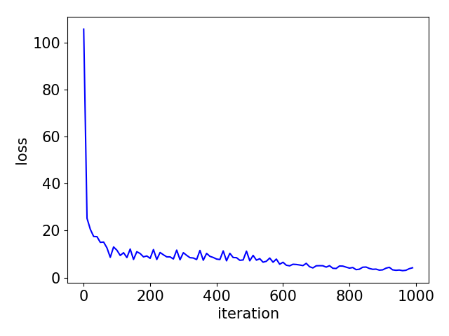
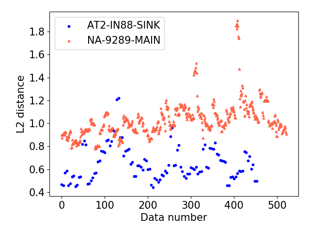

Fast Adaptive RNN Encoder-Decoder for Anomaly Detection in SMD Assembly Machine
=====

Introduction
-----
This repository provides the source code of the paper "The Fast Adaptive RNN Encoder-Decoder for Anomaly Detection in SMD Assembly Machine" by <a href="https://github.com/YeongHyeon">YeongHyeon Park</a> & <a href="https://scholar.google.co.kr/citations?user=0tPAxMgAAAAJ&hl=ko&oi=ao">Il Dong Yun</a>. Even it provides sample data of each classes at [sample_data](https://github.com/YeongHyeon/FARED_for_Anomaly_Detection/tree/master/sample_data).  

  
Figure 1. Structure of Fast Adaptive RNN Encoder-Decoder.  

  
Figure 2. The SMD assembly machine with microphone (red box).  

|Loss graph of training process|Anomaly detection process|
|:---:|:---:|
|||

Figure 3. Result of training and detection process.  

How to use?
-----

First, run the source code of the preprocessing for make dataset. It locates in the [preprocessing_source](https://github.com/YeongHyeon/FARED_for_Anomaly_Detection/tree/master/preprocessing_source) directory and it needs data like following structure. If the dataset is prepared then modify the data_path in `dat2npy_stft.py` and `dat2npy_mfcc.py`, and run it.  
```
Data
├── AT2-IN88-SINK
│   ├── data_1.wav
│   ├── data_2.wav
│   ├── data_3.wav
│   │     ...
│   └── data_n.wav
├── NA-9473
│     ...
└── ST-4214-GE
```

After preprocessing run the `run.py` in [FARED_source](https://github.com/YeongHyeon/FARED_for_Anomaly_Detection/tree/master/FARED_source) directory. It generates chekpoint of parameters, log for visualizing the training process with tensorboard and etc. Finally it generates 'valid' directory that contains L2 distance of each class data that computed by the FARED, then it can be visualize as matplotlib or something.  
