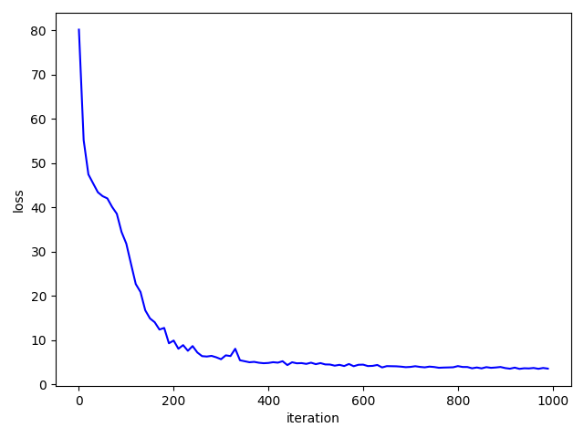

Fast Adaptive RNN Encoder-Decoder for Anomaly Detection in SMD Assembly Machine
=====

## Introduction
This repository provides the source code of the paper <a href="https://www.mdpi.com/1424-8220/18/10/3573">"Fast Adaptive RNN Encoder-Decoder for Anomaly Detection in SMD Assembly Machine"</a>.

<div align="center">
    
  <p>The SMD assembly machine with microphone (red box)</p>
</div>


## Requirements
* Python 3.5.2  
* Tensorflow 1.4.0  
* Numpy 1.13.3  
* Scipy 1.2.0  
* Matplotlib 3.0.2  
* Librosa 0.5.1


## Usage
### Preparing the dataset
First, Organize the audio dataset and keep as below (when using other wav files). This repository provides example of data organization, so you can conduct experiment directly!
```
data_for_experiment
├── Class-1
│   ├── data_1.wav
│   ├── data_2.wav
│   ├── data_3.wav
│   │     ...
│   └── data_n.wav
├── Class-2
│     ...
└── Class-3
```
Run the python script as following.  
```
$ cd preprocessing_source
$ python dat2npy_mfcc.py
```
After, running above python script the directory named with 'dataset_mfcc' will be generated. Use `dat2npy_stft.py` instead of `dat2npy_mfcc.py` if you want to train FARED with Short Time Fourier Transform (STFT). The sample dataset is available at [sample_data](https://github.com/YeongHyeon/FARED_for_Anomaly_Detection/tree/master/sample_data).

### Training and Test
```
$ cd FARED_source
$ python run.py
```
After, training FARED, it measure the reconstruction error for each class. Reconstruction errors will be saved in 'valids' directory with 'npy' file. You can calculate Area Under the Curve (AUC) of Receiver Operating Characteristic (ROC) curve or something.  


:exclamation: The result of the experiment may differ to paper because we provide only sample audio data.

<div align="center">
    
  <p>Architecture of Fast Adaptive RNN Encoder-Decoder</p>  
</div>

### Result with sample data
<div align="center">
    
  <p>Result</p>  
</div>


### BibTeX
```
@Article{s18103573,
  AUTHOR = {Park, YeongHyeon and Yun, Il Dong},
  TITLE = {Fast Adaptive RNN Encoder–Decoder for Anomaly Detection in SMD Assembly Machine},
  JOURNAL = {Sensors},
  VOLUME = {18},
  YEAR = {2018},
  NUMBER = {10},
  ARTICLE-NUMBER = {3573},
  URL = {http://www.mdpi.com/1424-8220/18/10/3573},
  ISSN = {1424-8220},
  DOI = {10.3390/s18103573}
}
```
